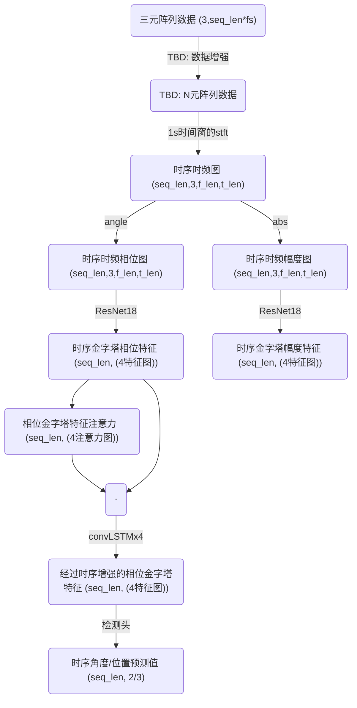

# ternary-array-passive-bearing
passive bearing based on ternary sonar array

## 数据流

1. A/D采样后为数字信号, 即采样时间离散, 数值为量化数值
2. 在python程序中收集采样后数据, 每1s数据解算一次
3. TODO: 降采样后的数据以及每秒解算出的角度存至数据库

## MARS

### 树莓派作为网关组网

- 电脑侧设置**eth0**静态ip为`10.3.21.67`
- 电脑侧设置与MARS@`10.30.4.77`通信时通过**eth0**接口收发, 网关为`10.3.21.66`

	```sh
	sudo ip route add 10.30.4.77 via 10.3.21.66 dev eth0
	```

- 树莓派侧**eth1**设置静态ip为`10.30.4.1`, 子网掩码`255.255.255.0`, 网关`10.30.4.1`, 开启ip转发

	```sh
	# 临时 (重启后失效)
	sysctl -w net.ipv4.ip_forward=1
	# 永久
	sudo vi /etc/sysctl.conf # 取消net.ipv4.ip_forward=1的注释
	sudo sysctl -p /etc/sysctl.conf
	```

#### 路由配置命令备忘

```bash
# 查看当前路由
ip route
# 删除指定路由
sudo ip route del default via <gateway_ip> dev <interface>
# 添加路由并设置优先级 (数值越小优先级越高)
sudo ip route add default via <gateway_ip> dev <interface> metric <new_metric>
```

#### 通过IDSSE有线网远程访问

1. 确保树莓派不在金属舱内（可接收到WiFi信号）
2. 电脑有线连接树莓派，ssh中以`sudo nmtui`连接手机热点并断开树莓派中ip为`10.30.4.1`的接口
3. 树莓派有线连接入IDSSE有线网，电脑接入手机热点
4. 以TigerVNC访问ip`leo-rpi4.local`，打开浏览器访问登录页面

#### 故障修复

遇到无法访问的情况，可尝试以下方法：
1. 检查网络链路是否断路、连接不稳定，裸露处是否有生锈
2. 检查电脑对应网络接口是否设置了静态ip
3. 断开电脑其他网络接口，避免因为掩码问题使用了错误的网关
4. 重启树莓派
5. 重启电脑

## 模型



TODO: 调查convLSTM的意义, 或者说输出与输入的区别, 确认我的注意力确实有用
- 考虑直接将相幅金字塔特征拼接

### 特征增强

- 将三阵元数据以线性预测虚拟阵元补阵元减小阵元间距
- 将三阵元数据输入到GAN, 生成更多阵元的数据. 如果仅用于数据增强, 若背景仅是白噪声无意义

## 仿真

[用torch生成音频](https://pytorch.org/audio/stable/tutorials/oscillator_tutorial.html)

## 参考资料

- [dash.dcc.Graph属性](https://dash.plotly.com/dash-core-components/graph#graph-properties)
- [通过dcc.Interval进行实时刷新](https://dash.plotly.com/live-updates)
- [plotly Python接口文档](https://plotly.com/python/)
- [参考实现: dash-wind-streaming](https://dash.gallery/dash-wind-streaming/), [代码](https://github.com/plotly/dash-sample-apps/blob/main/apps/dash-wind-streaming/app.py)
- [在Dash回调间共享数据](https://dash.plotly.com/sharing-data-between-callbacks)
- [如何正确使用numba给Python加速？](https://www.zhihu.com/question/406931055)
- [Parallel Programming with numpy and scipy](https://scipy.github.io/old-wiki/pages/ParallelProgramming)